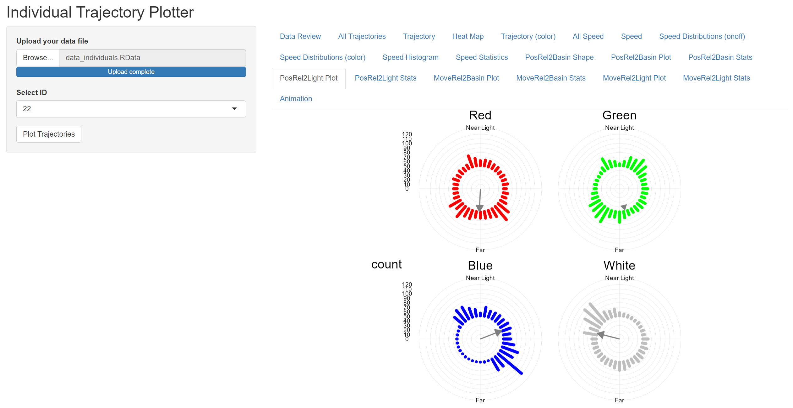
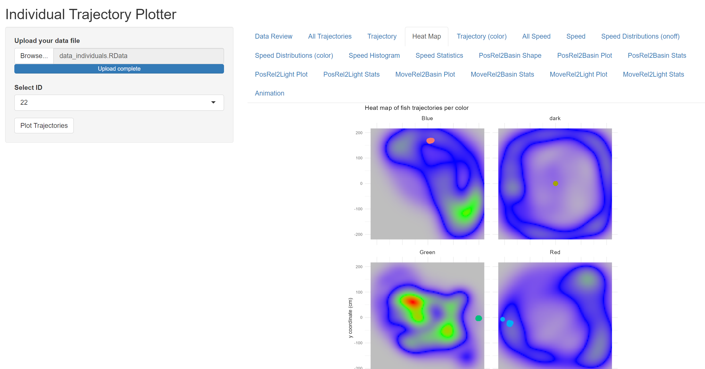
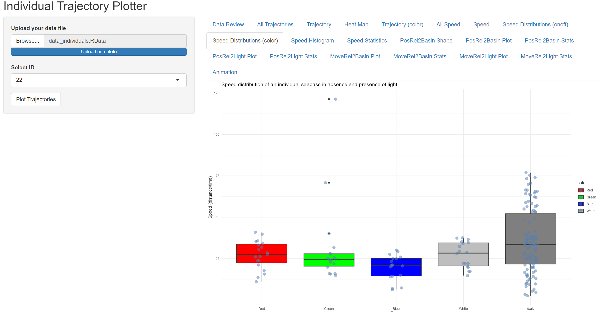

# 🐟 Individual Trajectory Plotter

This Shiny application visualizes and analyzes the swimming behavior of fish individuals tracked over time. It provides detailed tools to plot movement trajectories, speed patterns, heat maps, and angular behavior relative to points of interest (like a light source or basin center).

## 🔍 Features

- **Upload your data** (`.RData` or `.csv`)
- **Data review panel**
- **Visualize all or individual trajectories**
- **Speed analysis (raw & binned)**
- **Distribution plots by light condition (`on/off`) and by light color**
- **Relative position and movement analysis in polar coordinates**
- **Animated movement trajectories**

---

## 🖼️ Preview

| Trajectories Overview | Heat Map by Color | Speed Binned vs. Raw |
|-----------------------|-------------------|-----------------------|
|  |  |  |


---

## 📦 Installation

Make sure you have R and RStudio installed. Then install the required packages:

```R
install.packages(c("shiny", "plotly", "ggplot2", "dplyr", "readr", "scales", "hms", "moveHMM",
                   "car", "purrr", "dunn.test", "tidyr", "stringr", "plyr", "REdaS", "circular",
                   "discr", "ggnewscale", "ggpubr", "gganimate", "grid", "gifski", "gridExtra"))
```

---

## 🚀 How to Run

1. Clone this repository or download the source files.
2. Open the app in RStudio.
3. Run the app using:

```R
shiny::runApp()
```

---

## 📁 Input Data Format

Accepted formats:
- `.RData` file containing a data frame named `d`
- `.csv` file with the following columns (example):  
  `id`, `x`, `y`, `time`, `color`, `onoff`, `x_light`, `y_light`

Each row should represent one observation (one time point per individual fish).

---

## 📊 Output Tabs

| Tab Name                | Description                                                                 |
|-------------------------|-----------------------------------------------------------------------------|
| `Data Review`           | See uploaded data columns, sample values, and breakdown by color/event     |
| `All Trajectories`      | Trajectories of all individuals (grouped by condition)                     |
| `Trajectory`            | Detailed trajectory of selected individual                                 |
| `Heat Map`              | Density plot of spatial usage per light color                              |
| `Trajectory (color)`    | Trajectory and orientation toward light by color                           |
| `All Speed`             | Raw and binned speeds for all individuals                                  |
| `Speed`                 | Speed trend of selected individual                                         |
| `Speed Distributions`   | Boxplots and jitter plots for `on/off` and by `color`                      |
| `Speed Histogram`       | Speed histogram per color                                                  |
| `Speed Statistics`      | Kruskal-Wallis and Dunn’s test results                                     |
| `PosRel2Basin`/`Light`  | Directional positioning analyses using polar plots                         |
| `MoveRel2Basin`/`Light` | Orientation of movement relative to basin or light source                  |
| `Animation`             | Animated trajectory playback using `gganimate`                             |

---

## 📷 Exporting Plots

All plots are rendered via `ggplot2` and can be saved via the built-in RStudio export button or `ggsave()` for scripting.

---

## 🧐 Notes for Developers

- Polar statistics are computed using `circular::rayleigh.test()`
- Speed is computed per 10-second bins and joined back for plotting
- Ensure that color levels are consistent across all plots
- The app uses `reactiveVal()` for dynamic updates after file upload

---

## 📜 License

MIT License

